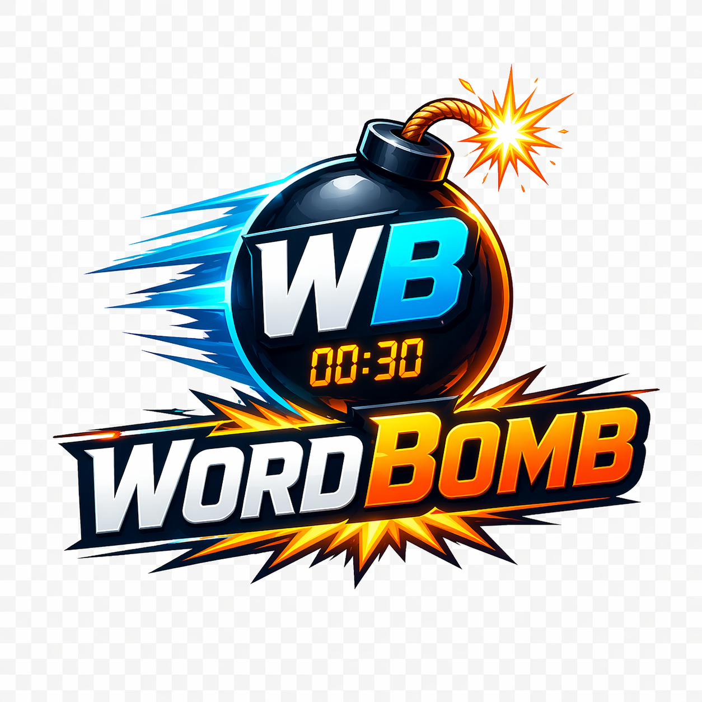
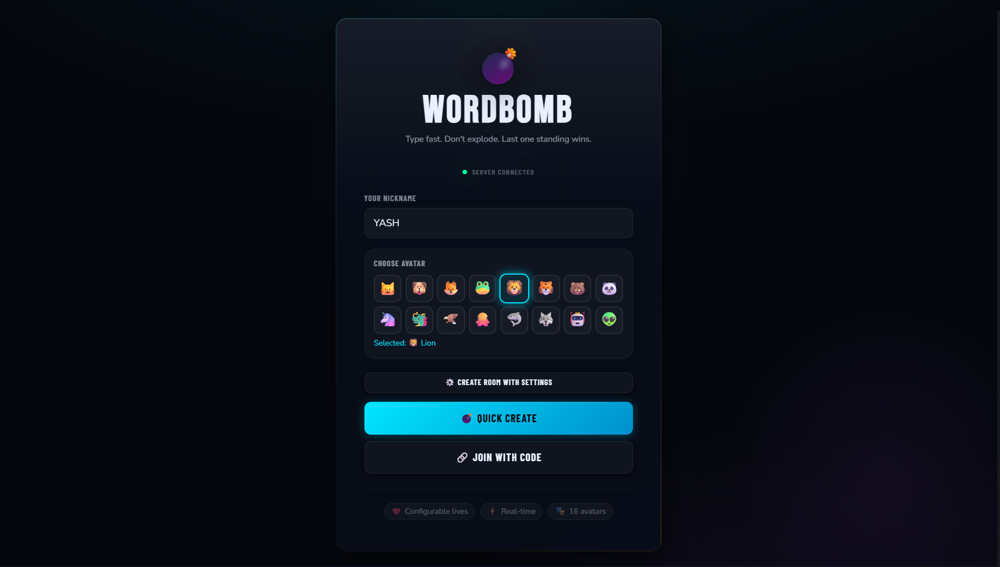
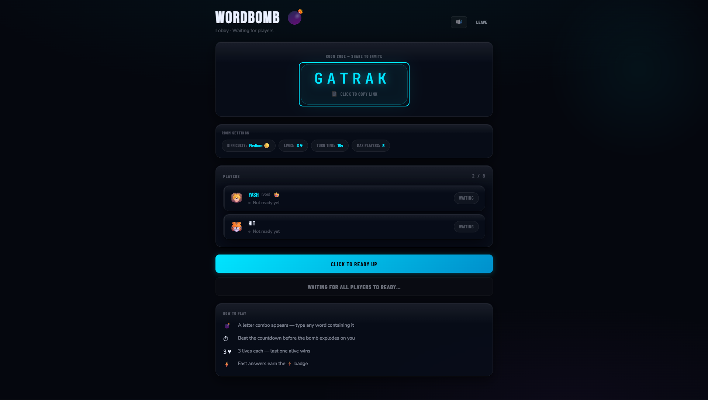
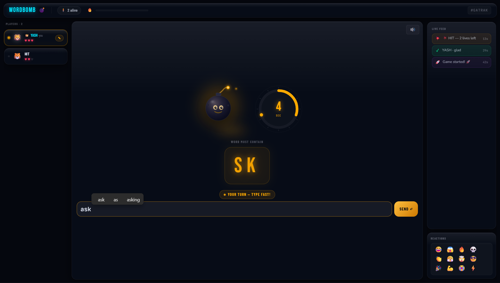
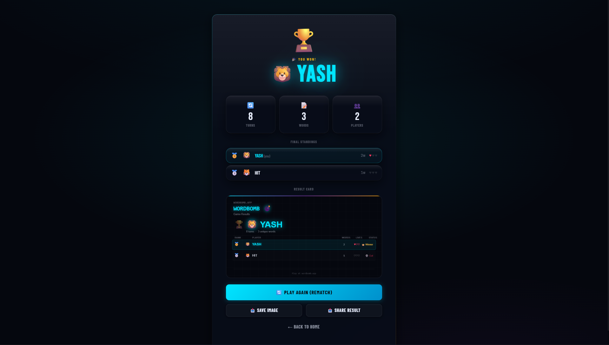

<p align="center">
  
</p>

<h1 align="center">WordBomb</h1>

<p align="center">
  Real-time multiplayer word duel with timed combo challenges.
</p>

<p align="center">
  
  
  
  
</p>

WordBomb is a fast party game where players must type a valid word containing the current letter combo before the bomb explodes. Miss your turn, lose a life. Last player alive wins.

## ✨ Highlights

- Real-time multiplayer private rooms
- Host controls and ready system
- Difficulty settings and shrinking turn timer
- Reconnect support and rematch voting
- Mobile + desktop friendly UI

## 🖼️ Screenshots






## ⚡ Quick Start

### ✅ Requirements

- Node.js 20.19.0+

### 📦 Install

```bash
npm install --prefix client
npm install --prefix server
```

### 🖥️ Run Server

```bash
npm run dev --prefix server
```

### 💻 Run Client

```bash
npm run dev --prefix client
```

### 🌐 Open

- Client: http://localhost:5173
- Server health: http://localhost:3002/health

## 🧰 Tech Stack

- Client: React, React Router, Vite, Socket.IO Client
- Server: Node.js, Express, Socket.IO
- Architecture: In-memory room + game engine

## 🌳 Project Structure

```text
wordbomb/
|-- client/
|   `-- src/
|       |-- components/
|       |-- hooks/
|       |-- pages/
|       |-- services/
|       |-- state/
|       |-- styles/
|       `-- utils/
`-- server/
    `-- src/
        |-- config/
        |-- data/
        |-- engine/
        |-- managers/
        `-- socket/
```

## 📝 Notes

- Game state is currently in-memory (no database yet).
- Great for local play and small deployments.
